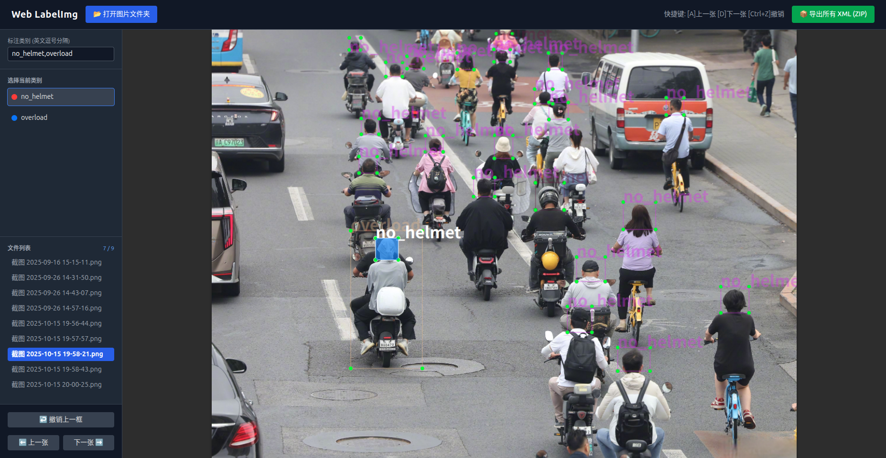

# LiteBBox - 极简 Web 目标检测标注工具

一个轻量级的 Web 端边界框（Bounding Box）标注工具，专为目标检测任务设计。输出 **Pascal VOC XML** 格式，兼容主流训练框架。

提供 **两个独立实现**：

| 实现 | 文件 | 运行环境 | 画框方式 |
|---|---|---|---|
| 纯 HTML（推荐） | `index.html` | 浏览器直接打开，零依赖 | 鼠标拖拽 |
| Gradio（Python） | `gradio_labelimg.py` | Python + Gradio 服务端 | 两次点击定框 |

## 效果预览



## 功能特性

- **文件夹批量加载** — 一次选择整个图片文件夹
- **多类别支持** — 英文逗号分隔类别名，一键切换
- **实时预览** — 彩色边界框 + 类别标签实时渲染
- **撤销操作** — 移除最后一个框（HTML 版支持 Ctrl+Z）
- **键盘快捷键** — `A` 上一张 / `D` 下一张（HTML 版）
- **Pascal VOC XML** — 行业标准输出格式，可配合 YOLO 转换工具使用
- **ZIP 打包导出** — 一键下载所有标注文件
- **十字准星** — 精确定位标注位置（HTML 版）
- **深色主题** — 长时间标注更舒适

## 快速开始

### 方式一：纯 HTML（推荐）

无需安装任何环境，双击 HTML 文件即可在浏览器中使用。

```bash
# 双击打开，或命令行启动：
open index.html          # macOS
xdg-open index.html      # Linux
start index.html         # Windows
```

1. 点击 **打开图片文件夹** 加载图片
2. 在图片上 **拖拽** 绘制边界框
3. 从左侧选择正确的类别
4. 使用 `A` / `D` 键或按钮切换图片
5. 完成后点击 **导出所有 XML (ZIP)** 下载标注文件

### 方式二：Gradio（Python）

需要 Python 3.8+ 及以下依赖：

```bash
pip install gradio Pillow
```

运行：

```bash
python gradio_labelimg.py
```

浏览器打开 `http://localhost:7860`。

1. 上传图片文件夹
2. **点击左上角**，再 **点击右下角**，两点确定一个框
3. 选择类别，点击 **保存当前 XML**
4. 标注完成后点击 **打包下载所有标签** 获取 ZIP 文件

## 输出格式

每张标注的图片会生成对应的 Pascal VOC XML 文件：

```xml
<annotation>
  <folder>images</folder>
  <filename>example.jpg</filename>
  <size>
    <width>1920</width>
    <height>1080</height>
    <depth>3</depth>
  </size>
  <object>
    <name>car</name>
    <bndbox>
      <xmin>100</xmin>
      <ymin>200</ymin>
      <xmax>500</xmax>
      <ymax>600</ymax>
    </bndbox>
  </object>
</annotation>
```

## 支持的图片格式

- JPEG（`.jpg`、`.jpeg`）
- PNG（`.png`）
- BMP（`.bmp`）

## 技术栈

- **HTML 版**：原生 JavaScript、Canvas API、[Tailwind CSS](https://tailwindcss.com/)、[JSZip](https://stuk.github.io/jszip/)
- **Gradio 版**：[Gradio](https://www.gradio.app/)、[Pillow](https://python-pillow.org/)

## License

MIT
